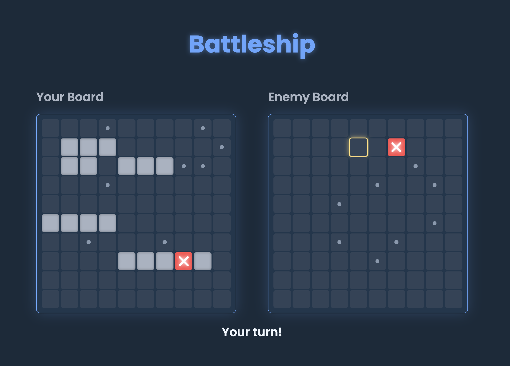

     
        <h1>🚢 Battleship 💥</h1>

<h2 align="center">A modern take on the classic naval combat game, built with Test-Driven Development.</h2>

    This project implements the game of Battleship with a sleek, responsive interface, allowing a human player to face off against a computer opponent. The core focus was on a clean, test-driven architecture that separates game logic from DOM manipulation.
  

   
  <a href="https://errantpianist.github.io/odin-battleship-2/"><strong>View Demo »</strong></a>

 

## Preview

 

 

### Built With

This project was built using modern web development tools and practices.

 

## Features

- **Classic Battleship Gameplay:** Play on a 10x10 grid against a computer opponent.
- **Interactive Ship Placement:** A dedicated placement phase allows players to strategically place their fleet on the board.
- **Dynamic UI:** Features include ship rotation and a "ghost ship" preview on hover for intuitive placement.
- **Intelligent Opponent:** The computer player makes random, legal moves, ensuring it never attacks the same square twice.
- **Modern Look & Feel:** A sleek, dark-themed UI with smooth animations and clear visual feedback for hits, misses, and game status.

 

## Outcome

- Successfully built a complete application following a strict **Test-Driven Development (TDD)** workflow, ensuring all logic was robust and reliable before touching the DOM.
- Demonstrated a clear **separation of concerns** by architecting the game with distinct modules for core logic (Classes for `Ship`, `Gameboard`, `Player`) and DOM interaction.
- Utilized **ES6 Modules** and **Webpack** to create a maintainable, scalable, and optimized codebase.

 

## What I Learned

This project was a deep dive into professional software engineering practices.

- **Test-Driven Development with Jest:** The core of this project. I learned to write failing tests first, then implement the code to make them pass. This included using **mock functions** (`jest.fn()`) to test interactions between modules, such as ensuring a `Player`'s attack correctly called the `receiveAttack` method on the opponent's `Gameboard`.
- **Object-Oriented Design:** I designed and implemented classes (`Ship`, `Gameboard`, `Player`) with clear public interfaces and encapsulated logic, reinforcing the Single Responsibility Principle.
- **Complex DOM Manipulation:** The project required creating an interactive UI purely from the state of JavaScript objects. The ship placement phase, with its hover previews and validation feedback, was a particularly insightful challenge in managing DOM events and state simultaneously.
- **Advanced Event Handling:** I managed a full game loop with distinct phases (placement vs. combat), controlled by user events and application state, including turn-based logic and game-over conditions.

 

## Reflections

After my last project, I noted that I needed to learn TDD. This project was an experiment in applying TDD concepts.

Building the `Gameboard` and its complex rules (like preventing duplicate attacks or overlapping ships) on a foundation of passing tests gave me confidence in my logic. When it came time to build the UI, I could trust that the "engine" of the game was solid.

The most rewarding part was implementing the "ghost ship" preview. It was a feature that required CSS, DOM event listeners, and game state logic to all be in sync. Seeing it work for the first time was pretty cool. This project truly solidified the value of planning and testing first.

 

## Acknowledgments

- Thanks to [The Odin Project](https://www.theodinproject.com/) for putting together such an extensive and challenging open-source curriculum!

 

## Author

